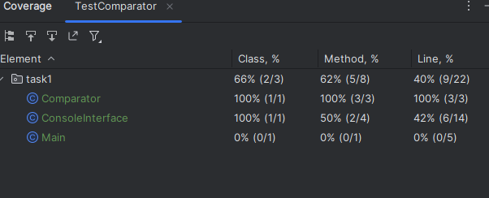

### Отчет по тестированию программы сравнения средних арифметических двух массивов

Файл тестирования содержит:
* 2 Юнит-теста
  * testAverageCalculation()
  * testComparator()
* 2 Интеграционных теста
  * testTestComparatorWithEqualArrays()
  * testTestComparatorWithBiggestFirstArray() 

Классы Comparator и ConsoleInterface покрыты тестами на 100% 
